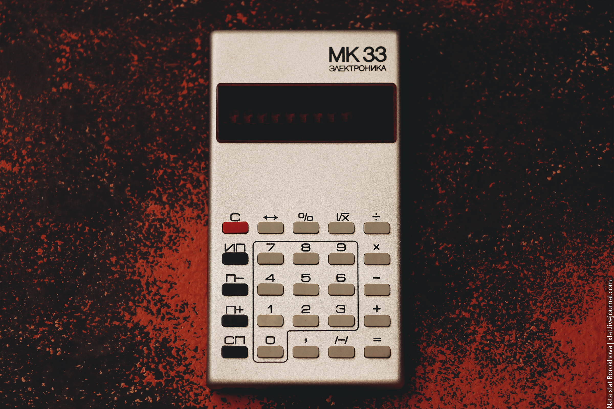

Вступление:

Всем привет! Это мой первый сложный проект на JavaScript. Я выбрал разработку калькулятора, так как это отличная возможность для отработки и улучшения навыков программирования. Калькулятор можно создать в самых разных вариантах: от простых моделей с ограниченными функциями до сложных инженерных и медицинских устройств. Работа над таким проектом напоминает игру в шахматы: множество вариантов реализации и взаимодействия с пользователем, что приводит к разнообразным ошибкам и вызовам.

Краткое описание:

Дизайн калькулятора вдохновлен советским устройством Электроника 33. SovietCulc поддерживает базовые математические операции, работу с процентами, возведение в степень, отмену последнего введенного числа, сброс и десятичные дроби. Особенностью является функция непрерывного вычисления, которая позволяет получать результаты операций сразу после ввода.

Во время разработки я столкнулся с различными проблемами, начиная от простых ошибок, таких как деление на ноль, попытка извлечь корень из отрицательного числа , попадание в переменные ненужных знаков и т.п.  и заканчивая сложной реализацией непрерывного вычисления. В процессе я узнал о таких принципах, как MDAS и PEMDAS, которые помогают правильно обрабатывать операции.

Непрерывное вычисление я сделал таким образом : 

Например у нас есть выражение 3 + 2 - 1.
Я добавил переменную которая хранит знак предыдущей операции. Если эта переменная заполнена, то будет рассчитана сумма 3+2, если значение переменной нет или оно совпадает с текущей операцией, то будет рассчитана часть выражения -1.

Технологии:

Калькулятор написан на нативном JavaScript, CSS, HTML, Flex/Grid, BEM. Использован редактор кода Visual Studio Code.

Использование:

Калькулятор легко открыть по ссылке благодаря GitHub Pages. Просто вводите числа и операции и получайте результат. Если заметите баги, пожалуйста, сообщите мне.  Буду благодарен за обратную связь!

Контакты:

Можете связаться со мной по адресу электронной почты kosstascorp@gmail.com  или через Telegram  https://t.me/GhostInTheWeb.

Лицензия: MIT License.
 

Фото оригинальной модели и полезная ссылка : 

https://ru.wikipedia.org/wiki/Электроника_МК-33

English language

Introduction:

Hello everyone! This is my first complex project in JavaScript. I chose to create a calculator because it’s a great opportunity to practice and improve my programming skills. Calculators can be made in various forms, ranging from simple models with limited functionality to advanced engineering and medical devices. Working on such a project feels like playing chess: there are many ways to implement and interact with the user, leading to diverse errors and challenges.

Overview:

The design of the calculator is inspired by the Soviet device Elektronika 33. SovietCulc supports basic mathematical operations, percentage calculations, exponentiation, removal of the last entered number, resetting, and decimal fractions. One unique feature is continuous calculation, which allows users to receive results immediately after entering operations.

During development, I faced different issues, starting from simple mistakes like division by zero, attempting to take the square root of a negative number, accidentally assigning unwanted signs to variables, etc. and ending with the complex implementation of continuous calculation. In the process, I learned about principles like MDAS and PEMDAS, which help correctly handle operations.

Continuous calculation is implemented as follows:

For example, we have an expression 3 + 2 - 1.
 I added a variable that stores the sign of the previous operation. If this variable is filled, the sum 3+2 will be calculated, otherwise or if the value matches the current operation, the part of the expression -1 will be calculated.

Technologies:

The calculator is written in native JavaScript, CSS, HTML, Flex/Grid, and BEM. Visual Studio Code editor was used.

Usage:

The calculator can be easily accessed via GitHub Pages. Just enter numbers and operations to get the result. If you notice bugs, please report them to me. I would appreciate your feedback!

Contact Information:

You can contact me at email address kosstascorp@gmail.com or through Telegram at https://t.me/GhostInTheWeb.

License: MIT License.
